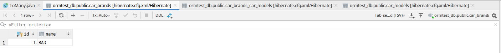
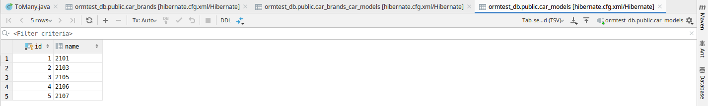
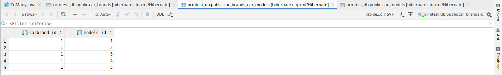

## Описание ##
Это учебный проект, в котором выполнены базовые задачи объектно-реляционного отображения (ORM) с помощью Hibernate.
#### Технологии проекта ####

## Снимки заполненных таблиц БД ##
#### 1. ToMany [#301848] ####
1.1. car brands

1.2. car models

1.3. brands-models
